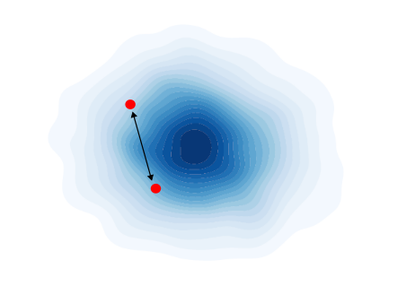
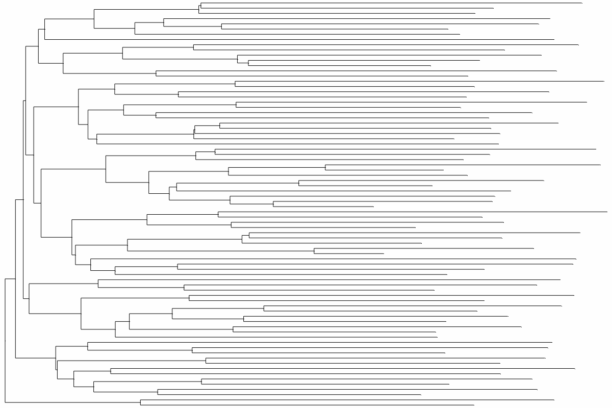

# PhyloEncode 0.1


<p align="center">
    
    
</p>

**PhyloEncode** is a variational autoencoder with maximum mean discrepancy regularization (**MMD-VAE**) implemented in **PyTorch**. It is designed for joint representation of **phylogenetic data, tip-associated data, and other tree metadata**. It encodes these inputs into an N-dimensional multivariate standard normal distribution while minimizing information loss. Input data should be preformatted using **phyddle** ([phyddle.org](https://phyddle.org)).

---

## Features
- Works with **phylogenies, tip data, and auxiliary datasets**.
- Requires [Phyddle](https://phyddle.org) generated **HDF5-formatted** input data.
- Provides tools for **training, encoding, and extracting feature representations** from phylogenetic data.

---

## Installation
Clone repository and from the **package root directory**, install via pip:

```bash
pip install .
```

---

## Training
To train the autoencoder, ensure your **phylogenetic and auxiliary data** are in phyddle format which outputs the data in a **HDF5** file. I recommend using Phyddle -s SF to create the data and file. See example/phyddle_sim_data for phyddle scripts to generate a set of BISSE training trees. Data file will be in the format directory.

```bash
cd example/phyddle_sim_data
phyddle -c phyddle_config.py
```

Once you have a training dataset, use the phytrain command. There is also an example phyloencode config file in the example dir for network settings.

- **Example command:** `phytrain --trn_data example_train_data.hdf5 --config example_config.py`  
- Type `phytrain -h` for more info

---

## Encoding with a Trained Autoencoder
To encode and decode a set of phylogenetic trees, use the **`phyencode`** and **`phydecode`** commands. To generate new trees from the approximate tree distribution use **`phygen`**. This tool draws samples from $N(0,\mathbb{I})$ and transforms these draws to a tree, tip data and tree-associated metadata via the trained decoder.

For more details on input formats and options, run:

```bash
phyencode -h
phydecode -h
phygen -h
```

---

## Documentation & Support
For detailed documentation of Phyddle tree formatting files, visit:  
[**phyddle.org**](https://phyddle.org/pipeline.html#format) or check the provided example scripts.

---

