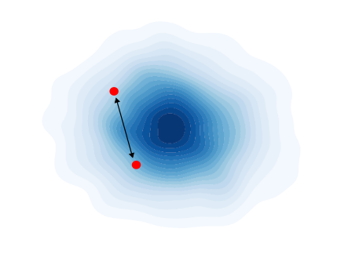
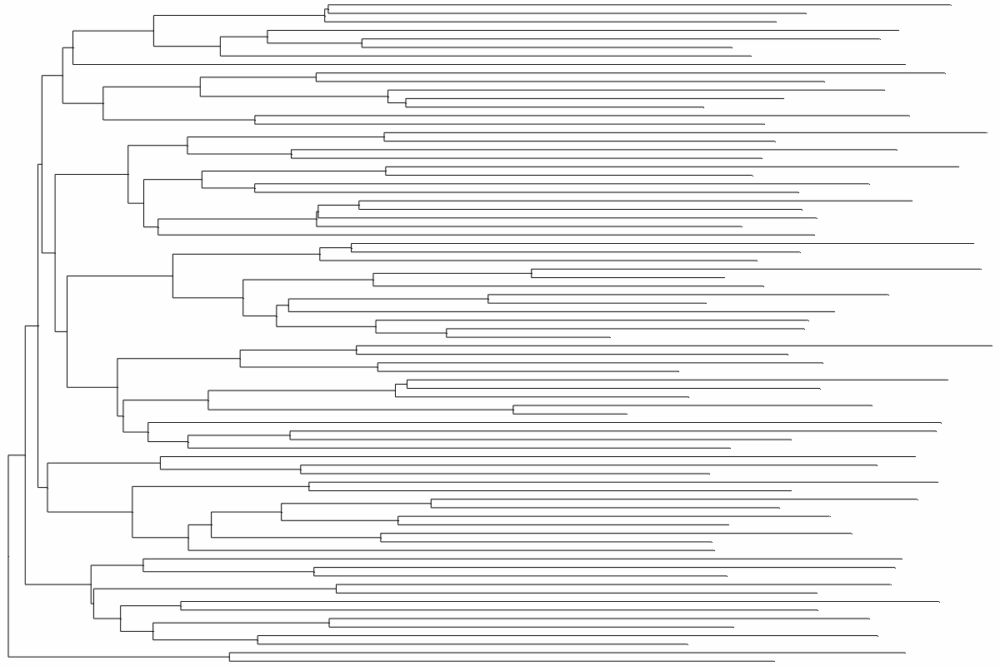

# PhyloEncode 0.1


<p align="center">
    
    
</p>

**PhyloEncode** is a Wasserstein autoencoder with maximum mean discrepancy regularization (**MMD-WAE**) implemented in **PyTorch**. It is designed for joint representation of **phylogenetic data, tip-associated data, and other tree metadata**. It encodes these inputs into an approximate N-dimensional multivariate standard normal distribution while minimizing information loss. Input data should be preformatted using **phyddle** ([phyddle.org](https://phyddle.org)).

---

## Features

- Works with **phylogenies, tip data, and auxiliary datasets**.
- Trains from [Phyddle](https://phyddle.org)-generated **HDF5** data.
- Provides tools for **training, encoding, reconstruction, decoding, and generation**.

---

## Installation

Clone repository and from the **package root directory**, install via pip:

```bash
pip install .
```

---

## Training

Training expects **phylogenetic and auxiliary data** from the Phyddle format step in an **HDF5** file. The included `example/phyddle_sim_data` configuration runs Phyddle's simulation and format steps (`SF`) to generate example BiSSE data:

```bash
cd example/phyddle_sim_data
phyddle -c phyddle_config.py
```

Once you have a training dataset, run `phytrain`. Copy and edit the included [`phytrain_config.py`](phytrain_config.py) template, then supply it with `--config`:

```bash
phytrain --trn_data path/to/training.hdf5 --config phytrain_config.py
```

For faster shuffled reads, add `--optimize_data`. From `training.hdf5`, this creates or reuses an uncompressed `training.phywae.hdf5`, leaves the Phyddle source unchanged, and trains from the optimized copy. The copy requires additional disk space.

```bash
phytrain --trn_data path/to/training.hdf5 --optimize_data
```

Run `phytrain -h` for all training options.

---

## Encoding with a Trained Autoencoder

Use `phyencode` to map trees and auxiliary data into latent coordinates, `phydecode` to decode saved latent coordinates, and `phypredict` to encode and reconstruct data in one step. Use `phygen` to draw latent samples from $N(0,\mathbb{I})$ and generate trees, tip data, and tree-associated metadata with the trained decoder.

For more details on input formats and options, run:

```bash
phyencode -h
phydecode -h
phypredict -h
phygen -h
```

---

## Documentation & Support

For detailed documentation of Phyddle tree formatting files, visit:  
[**phyddle.org**](https://phyddle.org/pipeline.html#format) or check the provided example scripts.

---
